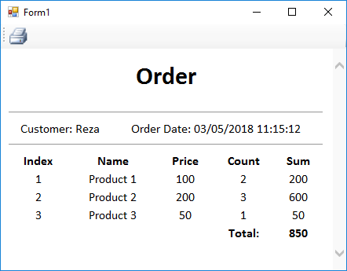

# Generating Html using T4 Run-time Templates

Sometimes you want to create a simple text report to print. In these cases generating html output is really useful.
Also sometimes you may need to generate some html content at runtime to include in an email. 

As an option to create html templates easlily, to make rendering logic and mixing html tags and data simpler, you can use [Run-time Text Templates](https://msdn.microsoft.com/en-us/library/ee844259.aspx). This way, you can use the t4 template as a view renderer which accepts a model (your data) and render the output.

Then you can pass data to the html template and render the report simply. If you are going to show it in a form, you can assign the output string to a `DocumentText` property of a [`WebBrowser`](https://msdn.microsoft.com/en-us/library/system.windows.forms.webbrowser.documenttext(v=vs.110).aspx) and call its [`Print`](https://msdn.microsoft.com/en-us/library/system.windows.forms.webbrowser.print(v=vs.110).aspx) method to print the document or [`ShowPrintPreviewDialog`](https://msdn.microsoft.com/en-us/library/system.windows.forms.webbrowser.showprintpreviewdialog(v=vs.110).aspx) to show print preview dialog:

